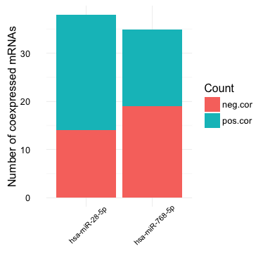
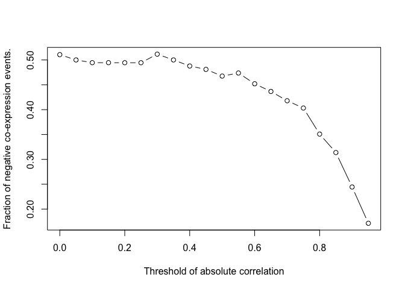

<!-- README.md is generated from README.Rmd. Please edit that file -->
miRTarget : Integrative analysis of miRNA and mRNA
==================================================

miRTarget helps to find miRNA predicted and validated targets. Two databases are used [miRecords](http://c1.accurascience.com/miRecords/) and [miRTarBase](http://mirtarbase.mbc.nctu.edu.tw)

Installation and loading
------------------------

-   Install the latest version from [GitHub](https://github.com/kassambara/miRTarget) as follow:

``` r
# Install
if(!require(devtools)) install.packages("devtools")
devtools::install_github("kassambara/miRTarget")
```

-   Loading

``` r
library(miRTarget)
```

Examples of miRNAs
------------------

``` r
miRNAs <- c("hsa-miR-28-5p", "hsa-miR-768-5p")
```

Find miRNA targets
------------------

### Get predicted miRNA targets

[miRecords.v4](c1.accurascience.com/miRecords/) database is used. For each miRNA, we want to identify the predicted target genes by at least 5/11 databases.

The 11 databases are : "diana", "microinspector", "miranda", "mirtarget2", "mitarget", "nbmirtar", "pictar", "pita", "rna22", "rnahybrid", "targetscan".

Internet connexion is required.

``` r
p_targets <- get_mirecords_pt(miRNAs, n = 5, species = "Homo sapiens",
                                      result_file = "mirna_mirecords_predicted_targets.txt",
                              show_progress = FALSE)
#> Results have been saved in the following file: mirna_mirecords_predicted_targets.txt
head(p_targets, 10)
#>       mirna_name target.gene_name    status
#> 1  hsa-miR-28-5p              EN2 predicted
#> 2  hsa-miR-28-5p         KIAA0355 predicted
#> 3  hsa-miR-28-5p            MYST3 predicted
#> 4  hsa-miR-28-5p            HOXA1 predicted
#> 5  hsa-miR-28-5p            YPEL3 predicted
#> 6  hsa-miR-28-5p              RHO predicted
#> 7  hsa-miR-28-5p            LSM12 predicted
#> 9  hsa-miR-28-5p            IKZF4 predicted
#> 10 hsa-miR-28-5p          CSNK1G1 predicted
#> 11 hsa-miR-28-5p            CABP7 predicted
```

### Get miRNA validated targets

miRecords and miRtarbase are used. Internet connexion is required.

1.  miRecords

``` r
mirecords_vt <- get_mirecords_vt(miRNAs, 
                                 species = "Homo sapiens", version = 4)
#> Downloading miRecords miRNA validated targets...
head(mirecords_vt, 10)
#>       mirna_name target.gene_name    status
#> 1  hsa-miR-28-5p          gag-pol validated
#> 2 hsa-miR-768-5p             <NA> validated
```

1.  miRtarbase

``` r
mirtarbase_vt <- get_mirtarbase_vt(miRNAs)
#> Downloading miRTarbase miRNA validated targets...
head(mirtarbase_vt, 10)
#>       mirna_name target.gene_name    status
#> 1  hsa-miR-28-5p        LINC00346 validated
#> 2  hsa-miR-28-5p           SEMA4C validated
#> 3  hsa-miR-28-5p           ZNF106 validated
#> 4  hsa-miR-28-5p          NKIRAS2 validated
#> 5  hsa-miR-28-5p           IMPDH1 validated
#> 6  hsa-miR-28-5p             AAAS validated
#> 7  hsa-miR-28-5p           CDKN1A validated
#> 8  hsa-miR-28-5p            CENPV validated
#> 9  hsa-miR-28-5p            SMYD1 validated
#> 10 hsa-miR-28-5p            PAQR5 validated
```

1.  Combine validated targets

``` r
v_targets <- combine_mir_vt(mirecords_vt, mirtarbase_vt)
# head(v_targets) 
```

### Merge predicted and validated targets

``` r
targets <- combine_mir_pvt(p_targets, v_targets)
head(targets)
#>      mirna_name target.gene_name status
#> 1 hsa-miR-28-5p          gag-pol      V
#> 2 hsa-miR-28-5p        LINC00346      V
#> 3 hsa-miR-28-5p           SEMA4C      V
#> 4 hsa-miR-28-5p           ZNF106      V
#> 5 hsa-miR-28-5p          NKIRAS2      V
#> 6 hsa-miR-28-5p           IMPDH1      V
```

Correlation between miRNA expression and target gene expressions
----------------------------------------------------------------

### Expression values of miRNAs

``` r
# Create some data with 4 samples (S) and two miRNAs
mirna_exprs <- data.frame(S1 = c(99, 8690), S2 = c(31, 612),
                          S3 = c(33, 1747), S4 = c(29, 2540))
rownames(mirna_exprs) <- c("hsa-miR-28-5p", "hsa-miR-768-5p")

print(mirna_exprs)
#>                  S1  S2   S3   S4
#> hsa-miR-28-5p    99  31   33   29
#> hsa-miR-768-5p 8690 612 1747 2540
```

### Expression value of miRNA potential target genes

``` r
data("gene_exprs")
head(gene_exprs, 10)
#>            S1   S2   S3   S4
#> AFF3     2254   14   15   15
#> IL7       250  104   22   14
#> SIGLEC10 1258  221  106  110
#> TUBB2A   1678  484   71   48
#> UNG       130 1883  212  125
#> TPM4      424 3835  744  199
#> E2F6       66  389  456  622
#> HSPA6    1021   91   75  109
#> UMPS      165 1792  754  688
#> E2F3      361 2455 1388 1361
```

### Keep only targets, which gene expressions are available

``` r
# Keep only target with gene expression data
targets <- subset(targets, targets$target.gene_name %in% rownames(gene_exprs) )
# Order data by miRNA name
targets <- targets[order(targets$mirna_name),  ]
# Change rownames
rownames(targets) <- paste0(targets$mirna_name, "::", targets$target.gene_name)
head(targets)
#>                            mirna_name target.gene_name status
#> hsa-miR-28-5p::CENPV    hsa-miR-28-5p            CENPV      V
#> hsa-miR-28-5p::PRDM2    hsa-miR-28-5p            PRDM2      V
#> hsa-miR-28-5p::ARHGAP42 hsa-miR-28-5p         ARHGAP42      V
#> hsa-miR-28-5p::PRSS16   hsa-miR-28-5p           PRSS16      V
#> hsa-miR-28-5p::TUBB2A   hsa-miR-28-5p           TUBB2A      V
#> hsa-miR-28-5p::PCYOX1   hsa-miR-28-5p           PCYOX1      V
```

### Combine miRNA and mRNA expression data

The name and the number of samples in the two data set should be identical.

``` r
mir_mrna_exprs <- combine_mir_mrna_exprs(mirna_exprs, gene_exprs)
```

### Correlation between miRNAs and the corresponding target genes

> If a gene is targeted by a miRNA we expect that the expression profile of the gene and the miRNA are anti-correlated.

``` r
res.cor <- corr_mir_mrna( mir_targets = MirTarget(targets),
                          mir_mrna_exprs = mir_mrna_exprs, 
                          show_progress = FALSE, stand = TRUE)
```

-   Number of mRNAs per miRNAs with an absolute correlation of 0.6

``` r
viz_mrna_per_mir(res.cor, coeff = 0.6)
```



-   If you want to visualize the fraction of negative correlation use this

``` r
viz_neg_cor_fraction(res.cor)
```



### Keep only negative correlation

r \< -0.6

``` r
# Negative correlation
neg.cor <- subset(res.cor, abs(cor.coeff) > 0.6 & cor.coeff < 0)
head(neg.cor, 10)
#>       mirna_name target.gene_name cor.coeff    p.value       fdr status
#> 1  hsa-miR-28-5p             IER3    -0.951 0.04901988 0.1416130      V
#> 2  hsa-miR-28-5p           ZNF569    -0.939 0.06081484 0.1506698      P
#> 3  hsa-miR-28-5p         TMEM167A    -0.935 0.06511116 0.1538991      V
#> 4  hsa-miR-28-5p             E2F6    -0.920 0.07967078 0.1726200      V
#> 5  hsa-miR-28-5p             SNX1    -0.866 0.13408097 0.2582300      V
#> 6  hsa-miR-28-5p            YIPF6    -0.860 0.13971692 0.2594743      V
#> 7  hsa-miR-28-5p           TEX261    -0.834 0.16580415 0.2973040      V
#> 8  hsa-miR-28-5p          CSNK1G1    -0.827 0.17309904 0.3000383      P
#> 9  hsa-miR-28-5p           PCYOX1    -0.806 0.19422393 0.3257950      V
#> 10 hsa-miR-28-5p           HNRNPC    -0.759 0.24051212 0.3908322      V

nmir <- length(unique(neg.cor$mirna_name))
ngn <- length(unique(neg.cor$target.gene_name))
valid <- subset(neg.cor, status %in% c("PV", "V"))
```

-   Number of negative interactions: 33
-   Number of unique gene : 33
-   Number of unique miRNA : 2
-   Validated target-interaction: 12
    -   Unique genes : 12
    -   Unique miRNAs : 1
